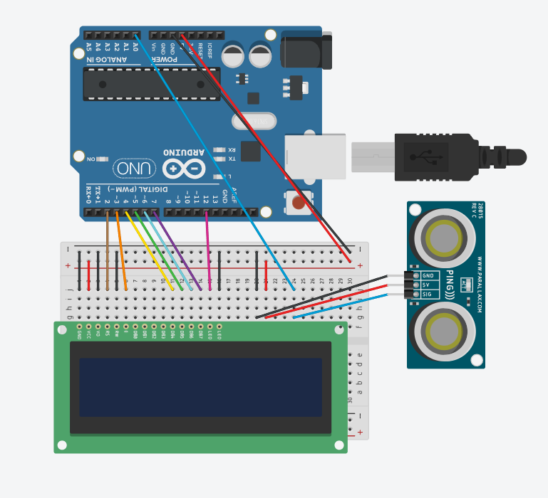

# Arduino Project: Loudness alert

## Project Overview

The loudness alert will visually show an alert when it detects sound above a certain intensity threshold.

## Hardware Components

- Arduino Uno
- 16x2 LCD display
- KY-038 microphone module

## Circuit Diagram



## Wiring Instructions

| Arduino Pin | Connected To |     Description     |
|-------------|--------------|---------------------|
| Pin 2       | LCD display  | Basic functioning   |
| Pin 3       | LCD display  | Basic functioning   |
| Pin 4       | LCD display  | Basic functioning   |
| Pin 5       | LCD display  | Basic functioning   |
| Pin 6       | LCD display  | Basic functioning   |
| Pin 7       | LCD display  | Basic functioning   |
| Pin 12      | LCD display  | Backlight control   |
| Pin A0      | Microphone   | Analog output       |
| 5V          | Everything   | Powering everything |
| GND         | Everything   | Powering everything |


## Software Requirements

- Arduino IDE [2.3.6]
- Libraries:
  - LiquidCrystal.h (by Arduino and Adafruit)

## Code Explanation

```arduino
// LOCAL FUNCTIONS
void update_display(int dB) { // updates the lcd display
  if (clear == true) { // checks the clear condition, if true it clears
    lcd.clear();
  }
  clear = false;

  lcd.setCursor(0,0); // displays the loudness in dB
  lcd.print("Loudness: ");
  lcd.print(dB);
  lcd.print(" dB");

  if (dB > limit) { // if its too loud
    lcd.setCursor(0,1);
    lcd.print("OVER LIMIT");

    for (int i = 0; i<10; i++){ // visual flashing alert
      digitalWrite(backlightpin, LOW); // turns off the backlight LED
      delay(100);
      digitalWrite(backlightpin, HIGH); // turns on the backlight LED
      delay(100);
    }

    delay(1000);
    clear = true;
  }

  if ((prev > 10) && (dB < 10)) { // just so the display looks clean(less clears = smoother looking)
    clear = true;
  }

  prev = dB; // also for display cleanliness
}

// ARDUINO FUNCTIONS
void setup() {
  pinMode(analogpin, INPUT); // microphone analog pin setup
  pinMode(backlightpin, OUTPUT); // lcd display backlight pin setup
  Serial.begin(9600);
  lcd.begin(16, 2);// set up the LCD's number of columns and rows
  digitalWrite(backlightpin, HIGH); // turns on the display backlight
  basevalue = map(analogRead(analogpin), 470, 570, 0, 1023); // setting an initial value for finding max/min in sampling later
}

void loop() {
  analogread = analogRead(analogpin); // takes analog reading
  analogread = map(analogread, 470, 570, 0, 1023); // maps reading into 0 to 1023 (for greater range)

  current = millis();
  elapsed = current - last; // tracking the sample time

  if (analogread > highestread){ // finding max in a sample
    highestread = analogread;
  }
  else if (analogread < lowestread){ // find min in a sample
    lowestread = analogread;
  }

  if (elapsed > sample_time){ // taking the delta the end of a sample
    samplecount++; // counting samples
    int delta = highestread-lowestread;
    sum += delta; // sum of all deltas in 10 samples

    if (samplecount > maxsamples){ // taking the average after a set of samples
      int average = sum/maxsamples;
      // int dB = 50 + 10*log10(average/30); // doesnt work lmao
      int dB = map(average, 0, 512, 50, 100); // maps sensor readings into decibels (tries to)
      update_display(dB); // updates display
      
      sum = 0; // resetting sum
      samplecount = 0; // resetting sample count

    }
    

    highestread = basevalue; // resets values stored in variables for the next sample
    lowestread = basevalue;
    last = current;
  }
  
}
```

The code works by taking a reading of the analog output of the sensor. The reading is then mapped into values from 0 to 1023. After that, the “millis()” function is used to get the number of milliseconds since the start of the program. This function is used to measure the time of one sample. The code works by finding the difference, the delta, between the greatest analog reading and the smallest analog reading over a given sample time. The sample time I set is 50 ms. Every 10 samples, the code takes the average of the past 10 deltas. That average is then converted into decibels using the map function. The decibel reading is then sent into the local function “update_display(dB)” in order to update the LCD display accordingly. The highest and lowest readings are set back to the basevalue that is determined in the setup at the end of the every loop.  

## Usage Instructions

1. Plug the Arduino into a computer.
2. Wait for the screen to turn on.
3. Use freely.

## Troubleshooting

- **The decibel reading is inaccurate**: Getting a pre-amplifier and changing the decibel conversion formula.

## Future Improvements

- Getting a preamplifier and improving the decibel conversion formula to display a more accurate decibel reading.

## References

- Bas on Tech. “SOUND SENSOR DATA ON ARDUINO SERIAL PLOTTER.” YouTube, YouTube, 20 Mar. 2020, www.youtube.com/watch?v=PYkzJQhFNlA. 
- Campbell, Scott. “How to Use Microphones on the Arduino.” Circuit Basics, 21 Oct. 2024, www.circuitbasics.com/how-to-use-microphones-on-the-arduino/. 
- SriTu Hobby. “Arduino Uno LCD Display 16x2 Tutorial.” YouTube, YouTube, 31 May 2020, www.youtube.com/watch?v=MnQ9IWnR0HU. 